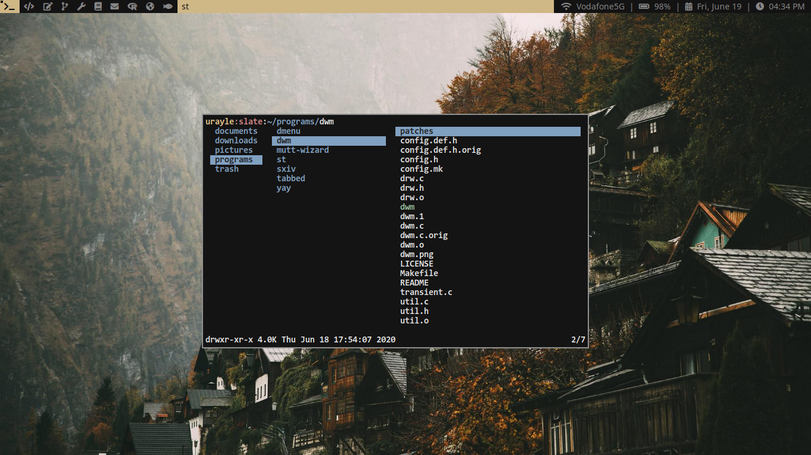
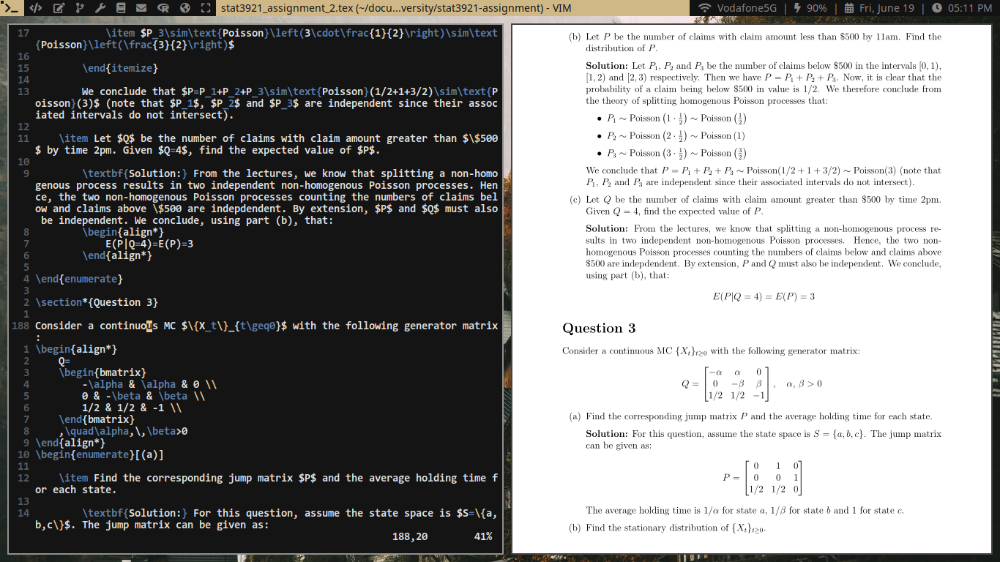
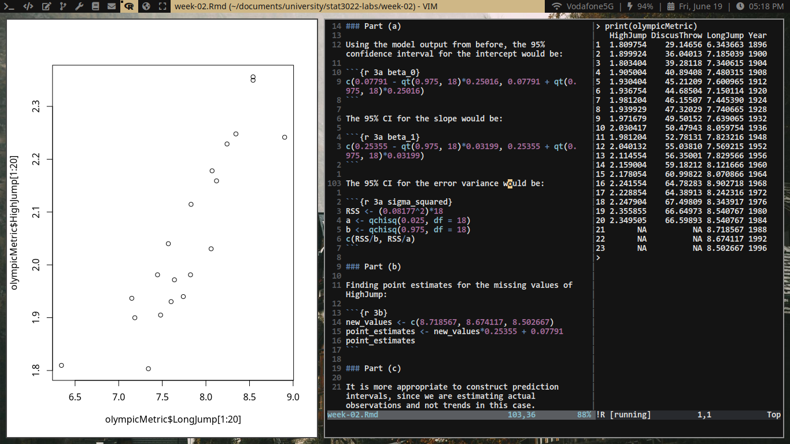

# My Arch Linux configuration (work in progress)

## Some screenshots

### File browser

### LaTeX setup

### R setup

## Some more information

- OS: Arch Linux
- WM: dwm
- Colors: Nord for Vim, see `config.h`'s for other
- PDF viewer: zathura
- Wallpaper: Lost the source (originally found in [/wg/](https://boards.4chan.org/wg/)), but [here](cliff.jpg) it is
